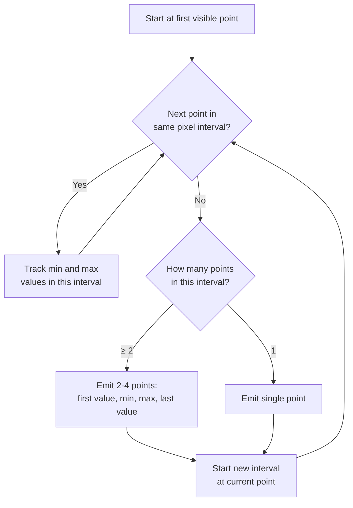
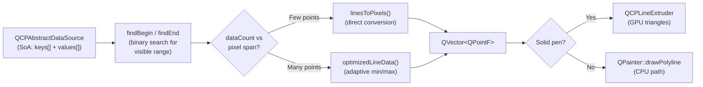

# Adaptive Sampling (1D Line Graphs)

When a QCPGraph2 has far more data points than pixels, NeoQCP consolidates multiple points per pixel into min/max clusters. This preserves the visual envelope (peaks and valleys are never hidden) while drawing only ~2 points per pixel.

## When It Activates

The algorithm compares the number of visible data points to the key-axis pixel span:

```
keyPixelSpan = |coordToPixel(firstKey) - coordToPixel(lastKey)|
maxCount = 2 × keyPixelSpan + 2
```

- If `dataCount < maxCount` → **direct rendering** (every point is converted to a pixel coordinate)
- If `dataCount >= maxCount` → **adaptive sampling** kicks in

Typical trigger: a 1000-pixel-wide plot showing 100K+ data points.

## Algorithm

The algorithm walks through the data linearly, grouping points into pixel-width intervals.



### Per-Interval Output

For each pixel interval containing 2+ data points, up to 4 points are emitted.
For single-point intervals, the point is emitted at its actual coordinates.

**Raw data** — thousands of points crammed into a few pixels:

```
 value
   ↑
   │    · ·      · ·                  ·  ·              ·
   │  ·     ·  ·     · · ·    ·    ·      · ·  ·   · ·   ·  ·
   │ ·   ·       ·       · ··  ··     ·        · · ·  ·  ·  · · ·
   │·  ·    · ·    ·         ·    · ·   · ·              ·      · ·
   │          ·      ·  · ·         ·       ·     · ·       · ·
   │                    ·                     ·
   ├─────────────────────────────────────────────────────────────── key
   │◄── pixel 1 ──►◄── pixel 2 ──►◄── pixel 3 ──►◄── pixel 4 ──►
```

**After adaptive sampling** — 2–4 output points per pixel, connected as a polyline.
Within each pixel interval, the algorithm emits first/min/max(/last) to preserve the envelope:

```
 value
   ↑
   │                 ○ max                ○ max
   │  ○ first       ╱  ╲  ○ first       ╱  ╲               ○ max
   │   ╲           ╱    ╲  ╲           ╱    ╲  ○ first     ╱╲
   │    ╲         ╱      ╲  ╲         ╱      ╲  ╲         ╱  ╲
   │     ╲       ╱        ╲  ╲       ╱        ╲  ╲       ╱    ╲
   │      ○ min ╱          ○  ○ min ╱          ○  ○ min ╱      ○
   │            last          last                last
   ├─────────────────────────────────────────────────────────────── key
   │◄── pixel 1 ──►◄── pixel 2 ──►◄── pixel 3 ──►◄── pixel 4 ──►
```

Within each pixel, the output is a **first → min → max → (last)** zigzag that traces
the value envelope. Across pixels, the last point of one interval connects to the first
of the next, forming a continuous polyline that faithfully represents the visual shape
of the data using only a handful of points.

| Point | X position | Purpose |
|---|---|---|
| **First** | 20% of interval | Entry value — connects smoothly from the previous interval |
| **Min** | 25% of interval | Lowest value in this pixel — preserves valleys |
| **Max** | 75% of interval | Highest value in this pixel — preserves peaks |
| **Last** | 80% of interval | Exit value — only emitted when the next data point skips at least one empty pixel interval (ensures a clean handoff) |

### Pixel Interval Calculation

The interval width equals one pixel in data coordinates:

```
keyEpsilon = |pixelToCoord(coordToPixel(x)) - pixelToCoord(coordToPixel(x) + 1)|
```

For **logarithmic** key axes, `keyEpsilon` is recalculated at each interval start because the data-space width of one pixel varies across the axis.

For **linear** axes, `keyEpsilon` is constant.

## Pixel-to-Data Mapping

The `linesToPixels()` function converts data coordinates to pixel coordinates. It handles both horizontal and vertical key-axis orientations:

```
Horizontal key axis:     pt.x = keyAxis→coordToPixel(key)
                         pt.y = valueAxis→coordToPixel(value)

Vertical key axis:       pt.x = valueAxis→coordToPixel(value)
                         pt.y = keyAxis→coordToPixel(key)
```

The conversion uses the axis's scale type (linear or logarithmic) internally. Data is stored in native types (float, int, etc.) and cast to `double` only at the coordinate conversion step — no intermediate copies.

## Data Flow



## Limitations

- **NaN values** in the adaptive sampling path can corrupt min/max tracking (NaN comparisons silently fail). This matches legacy QCPGraph behavior. Proper NaN gap handling is planned.
- The algorithm is **synchronous** — it runs in the replot phase on the main thread. For datasets >10M points, an async two-level resampling strategy is planned (see [Hierarchical Graph Resampling](../specs/2026-03-14-async-pipeline-design.md)).

## Key Files

| File | Role |
|---|---|
| `src/datasource/algorithms.h` | `qcp::algo::optimizedLineData()` — adaptive sampling algorithm |
| `src/datasource/algorithms.h` | `qcp::algo::linesToPixels()` — direct coordinate conversion |
| `src/plottables/plottable-graph2.h/.cpp` | QCPGraph2 — uses the algorithm during `draw()` |
| `src/datasource/abstract-datasource.h` | QCPAbstractDataSource — data source interface |
| `src/datasource/soa-datasource.h` | QCPSoADataSource — SoA container for keys + values |
