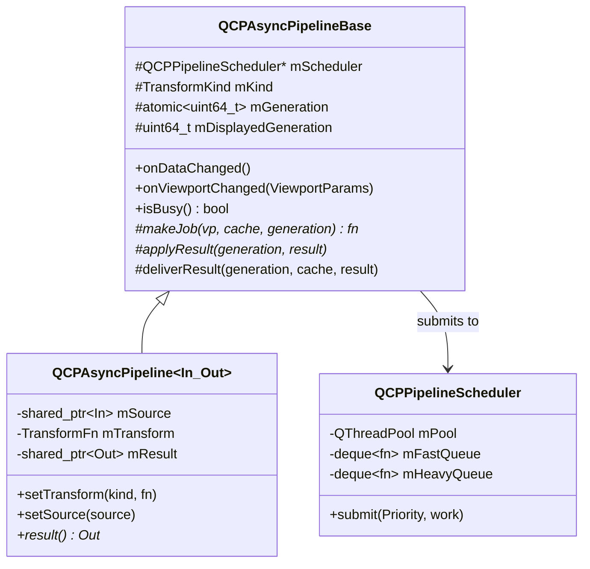
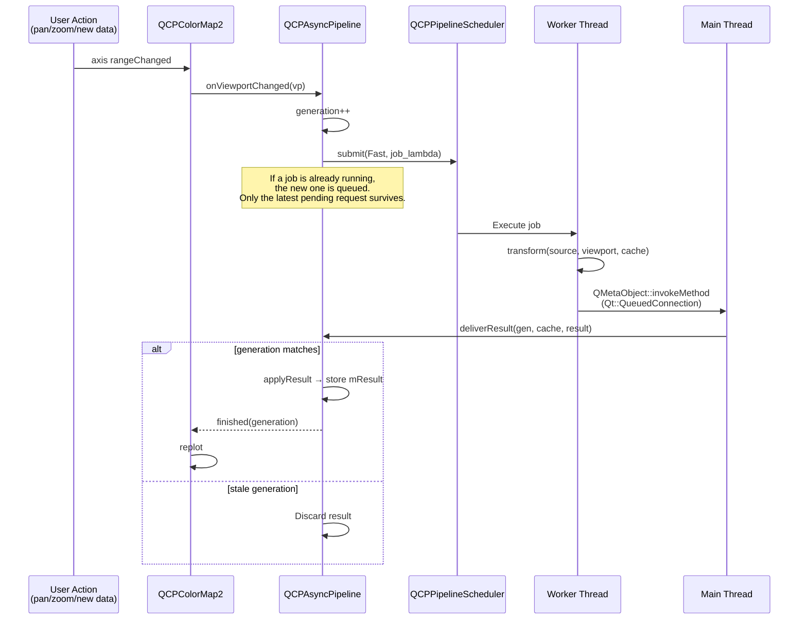

# Async Pipeline

NeoQCP's plottables can run expensive data transforms (resampling, filtering) off the GUI thread. The async pipeline infrastructure provides request coalescing, generation tracking, and thread-safe result delivery.

## Architecture



Two concrete type aliases are used:

```cpp
using QCPGraphPipeline   = QCPAsyncPipeline<QCPAbstractDataSource, QCPAbstractDataSource>;
using QCPColormapPipeline = QCPAsyncPipeline<QCPAbstractDataSource2D, QCPColorMapData>;
```

## Pipeline Scheduler

`QCPPipelineScheduler` wraps a `QThreadPool` with two priority queues:

- **Fast** — viewport changes (pan/zoom) — low latency, displaces pending heavy jobs
- **Heavy** — data changes (new data loaded) — can be deferred

Each `QCustomPlot` widget owns one scheduler, shared by all its plottables. This prevents oversubscription when many plottables replot simultaneously.

## Request Lifecycle



## Generation Tracking

Every call to `onDataChanged()` or `onViewportChanged()` increments an atomic generation counter. When a result arrives:

- If `generation > mDisplayedGeneration` → accept and store
- If `generation <= mDisplayedGeneration` → discard (same or newer result already arrived)

This handles the common case where the user pans rapidly, producing many viewport changes. Only the latest result is displayed.

## Request Coalescing

When a job is already running and a new request arrives, the pipeline stores it as `mPending`. When the running job completes, only the latest pending request is executed. Earlier intermediate requests are silently dropped.

```
Time ──────────────────────────────────────────────►
       Request A     Request B    Request C
       submitted     submitted    submitted
         │              │            │
    ┌────┴────┐    (replaced)   (replaced)
    │ Job A   │                     │
    │ running │                ┌────┴────┐
    └────┬────┘                │ Job C   │
         │                     │ running │
    Result A                   └────┬────┘
    displayed                       │
                               Result C
                               displayed

    Request B was never executed — coalesced away.
```

## Transform Kinds

```cpp
enum class TransformKind { ViewportIndependent, ViewportDependent };
```

- **ViewportIndependent** — transform result doesn't change with pan/zoom (e.g., data filtering). Re-run only on `onDataChanged()`.
- **ViewportDependent** — result depends on the visible range and pixel size (e.g., colormap resampling). Re-run on both `onDataChanged()` and `onViewportChanged()`.

## Cache

Each pipeline carries a `std::any mCache` that persists across job invocations. The transform function receives and can modify the cache:

```cpp
using TransformFn = std::function<
    shared_ptr<Out>(const In& source,
                    const ViewportParams& viewport,
                    std::any& cache)>;
```

This enables multi-level resampling strategies where an expensive first pass is cached and a cheap second pass runs on each viewport change (see [Hierarchical Graph Resampling](../specs/2026-03-14-async-pipeline-design.md) for the planned graph resampler).

## Destruction Safety

The pipeline uses a `shared_ptr<atomic<bool>> mDestroyed` flag. The destructor sets it to `true`. In-flight jobs check this flag before posting results back to the main thread, preventing use-after-free when a plottable is destroyed while a job is running.

## Key Files

| File | Role |
|---|---|
| `src/datasource/pipeline-scheduler.h` | QCPPipelineScheduler: thread pool with priority queues |
| `src/datasource/async-pipeline.h` | QCPAsyncPipelineBase + QCPAsyncPipeline<In,Out> template |
