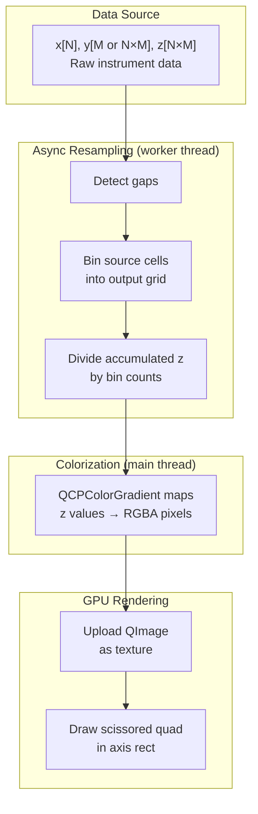
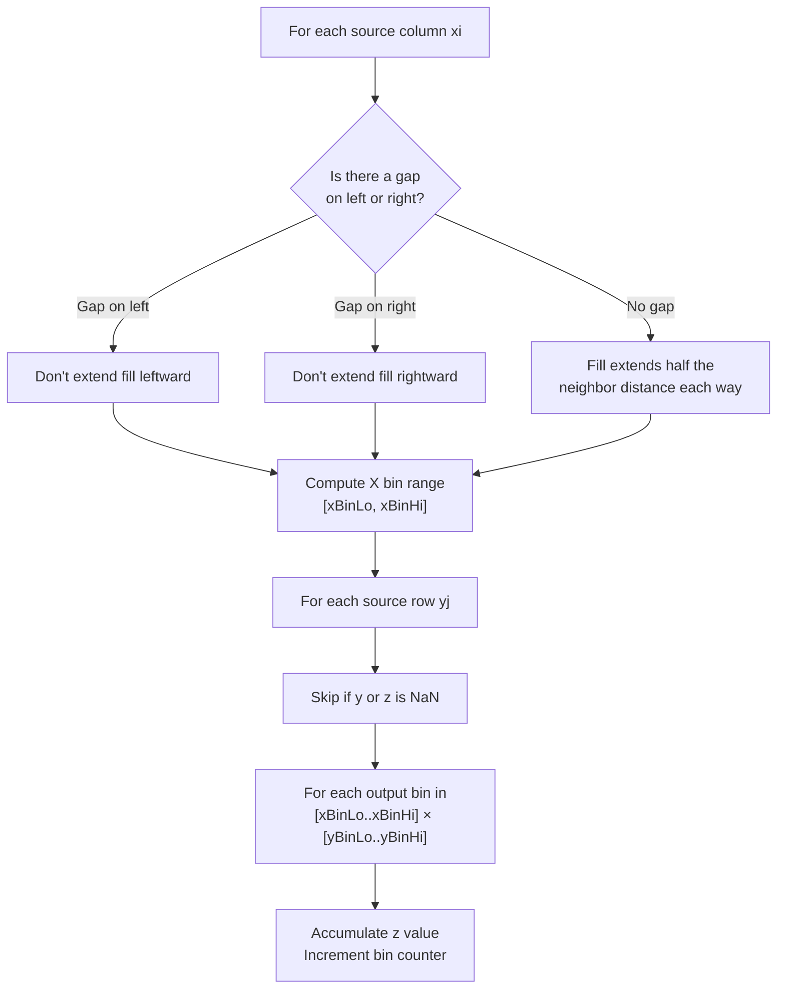

# Colormap Resampling (2D Heatmaps)

QCPColorMap2 displays 2D datasets (spectrograms, heatmaps) where the source data can have millions of cells. The resampling algorithm bins source data onto a screen-resolution output grid, running asynchronously on a worker thread.

## Overview



## Data Model

QCPColorMap2 accepts data via `QCPAbstractDataSource2D`, which represents a 2D grid of `(x, y, z)` values.

### Y Dimensionality

The data source auto-detects whether Y is uniform or varies with X:

| Case | Y array size | Meaning | Example |
|---|---|---|---|
| **1D Y** | `size(y) == M` | Same Y bins for all X rows | Fixed-frequency FFT spectrogram |
| **2D Y** | `size(y) == N×M` | Y bins vary per X row | Particle energy spectra where bins shift with spacecraft potential |

Auto-detection: `mYSize = size(z) / size(x)`, then `yIs2D = (size(y) == size(z))`.

### Zero-Copy Data

Data can be owned or viewed:

```cpp
// Owning: data is moved in, QCPColorMap2 manages lifetime
colorMap->setData(std::move(timestamps), std::move(freqs), std::move(power));

// Zero-copy view: caller manages lifetime
colorMap->viewData(x_span, y_span, z_span);
```

Both paths use `QCPSoADataSource2D<XC, YC, ZC>`, a template that accepts any `IndexableNumericRange` (std::vector, std::span, etc.).

## Resampling Algorithm

The algorithm lives in `qcp::algo2d::resample()`. It transforms the source grid into a pixel-resolution output grid in six steps.

### Step 1: Generate Output Axes

Two 1D arrays define the output grid coordinates:

```
xAxis = linspace(xRange.lower, xRange.upper, targetWidth)
yAxis = linspace(yRange.lower, yRange.upper, targetHeight)   // or logspace if yLogScale
```

`targetWidth` and `targetHeight` are chosen to be at least as large as the source data count within the viewport, and at most 4× the pixel dimensions. This ensures the output never loses resolution compared to the source.

### Step 2: Detect Gaps

See [Gap Detection](gap-detection.md) for the full algorithm. Gaps between consecutive X columns are marked in a boolean array.

### Step 3: Precompute Y Bin Ranges

Each source Y row maps to a range of output bins based on its local spacing. The fill region extends half the local spacing in each direction, ensuring continuous coverage without bleeding:

```
For source Y index j:
    halfSpacing = min(y[j] - y[j-1], y[j+1] - y[j]) / 2
    yBinLo = findBin(y[j] - halfSpacing, yAxis)
    yBinHi = findBin(y[j] + halfSpacing, yAxis)
```

### Step 4: Walk Source Data and Accumulate

For each source column `(xi)` and row `(yj)`:



The X fill range uses the same bounded-fill strategy as Y: each source column fills output bins within half the distance to its non-gap neighbors. At gap boundaries, fill is clamped to prevent data bleeding across gaps.

### Step 5: Divide

Each output bin divides its accumulated z sum by the number of source cells that contributed:

```
output[i][j] = accumulated[i][j] / count[i][j]
```

Bins with zero contributions are set to NaN (rendered as transparent).

### Step 6: Colorize

Back on the main thread, `QCPColorGradient::colorize()` maps z values to RGBA pixels row by row, producing a `QImage` ready for GPU upload.

## Pixel-to-Data Mapping

The output grid maps 1:1 to the viewport:

```
Output column i  ↔  xAxis[i]  ↔  data coordinate within keyRange
Output row j     ↔  yAxis[j]  ↔  data coordinate within valueRange
```

Two bin-finding functions handle the lower and upper bounds of fill ranges:

- `findBin()` — nearest-neighbor: ties go to the **closer** bin (used for lower bounds)
- `findBinFloor()` — ties go to the **lower** bin (used for upper bounds, giving exclusive-upper semantics)

```cpp
// Used for lower bounds (xBinLo, yBinLo)
int findBin(double value, const vector<double>& axis) {
    auto it = lower_bound(axis.begin(), axis.end(), value);
    int idx = distance(axis.begin(), it);
    if (idx > 0 && (value - axis[idx-1]) < (axis[idx] - value))
        --idx;
    return clamp(idx, 0, axis.size() - 1);
}

// Used for upper bounds (xBinHi, yBinHi)
int findBinFloor(double value, const vector<double>& axis) {
    auto it = lower_bound(axis.begin(), axis.end(), value);
    int idx = distance(axis.begin(), it);
    if (idx > 0 && (value - axis[idx-1]) <= (axis[idx] - value))
        --idx;  // ties go low
    return clamp(idx, 0, axis.size() - 1);
}
```

When rendering, the output image is positioned in the plot using axis coordinate-to-pixel conversion:

```
topLeft     = (keyAxis→coordToPixel(keyRange.lower),  valueAxis→coordToPixel(valueRange.upper))
bottomRight = (keyAxis→coordToPixel(keyRange.upper),  valueAxis→coordToPixel(valueRange.lower))
```

## Output Resolution Selection

The target resolution is chosen to balance sharpness and performance:

```cpp
int w = clamp(
    visibleSourceColumns / visibleFraction,        // scale to full data density
    max(visibleSourceColumns, pixelWidth),          // never go below source or screen resolution
    max(visibleSourceColumns, pixelWidth * 4)       // cap at 4× screen resolution
);
```

The `visibleFraction` factor estimates how much of the total data range is visible. When zoomed out, `visibleFraction ≈ 1` and `w ≈ sourceColumns`. When zoomed in, `w` scales up proportionally but is capped at 4× pixel resolution to limit memory use.

The lower bound ensures the output grid is always at least screen resolution. Without this, small datasets (e.g., 20 source columns) would produce very coarse output when zoomed in — each output bin covers many screen pixels, and the nearest-neighbor bin assignment causes visible jumps when panning.

## Async Integration

QCPColorMap2 uses `QCPColormapPipeline` (an alias for `QCPAsyncPipeline<QCPAbstractDataSource2D, QCPColorMapData>`). See [Async Pipeline](async-pipeline.md) for the threading model.

Resampling is triggered by:
- **New data** → `setDataSource()` / `dataChanged()`
- **Pan/zoom** → key or value axis `rangeChanged` signal
- **Scale type change** → value axis `scaleTypeChanged` signal

Each trigger calls `onViewportChanged()` on the pipeline, which increments the generation counter and submits a job. The pipeline coalesces rapid requests (e.g., during a drag-pan) so only the latest viewport is resampled.

When the result arrives on the main thread:
1. The resampled `QCPColorMapData` is stored
2. The map image is invalidated (forcing re-colorization)
3. A queued replot is triggered

## Key Files

| File | Role |
|---|---|
| `src/datasource/resample.h/.cpp` | `qcp::algo2d::resample()` — core resampling algorithm |
| `src/datasource/algorithms-2d.h` | Range queries and binary search for 2D data |
| `src/plottables/plottable-colormap2.h/.cpp` | QCPColorMap2 plottable |
| `src/datasource/abstract-datasource-2d.h` | QCPAbstractDataSource2D interface |
| `src/datasource/soa-datasource-2d.h` | QCPSoADataSource2D template |
| `src/datasource/async-pipeline.h` | QCPColormapPipeline type alias |
