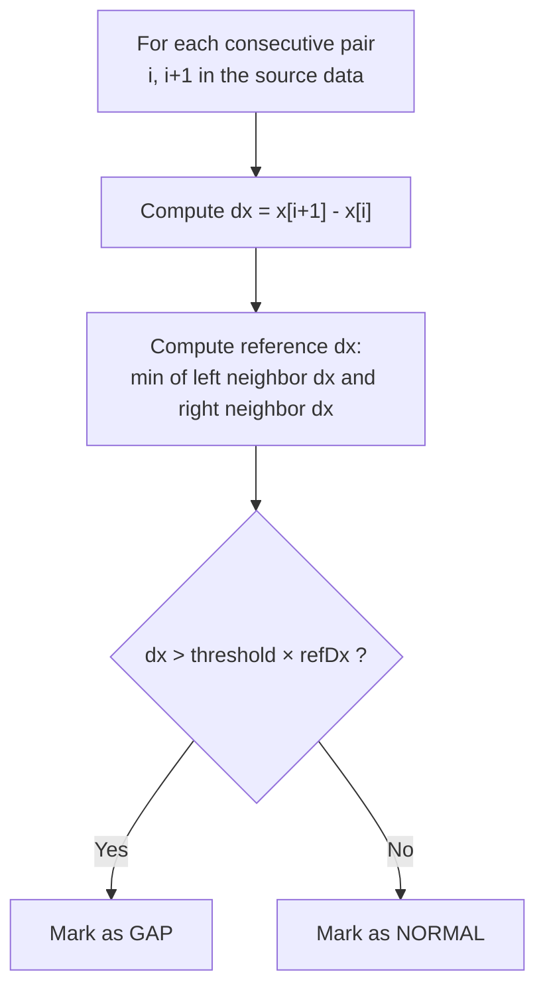
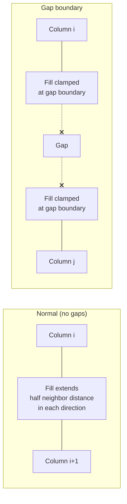

# Gap Detection

Scientific data often has gaps — missing timestamps, instrument outages, or non-contiguous data blocks. NeoQCP detects these gaps so they appear as blank regions rather than being interpolated across.

## The Problem

When data has gaps, naive rendering produces visual artifacts:

```
Source data:   ●  ●  ●  ●  ●              ●  ●  ●  ●  ●
                                    ↑
                              Data gap here

Without gap detection:   ●──●──●──●──●──────────●──●──●──●──●
                                        ↑
                              Line drawn across gap (wrong)

With gap detection:      ●──●──●──●──●          ●──●──●──●──●
                                        ↑
                              Blank region (correct)
```

For colormaps, the issue is similar: without gap detection, source cells on either side of a gap would bleed their fill into the gap region.

## Algorithm: Local Neighbor-Based Detection

NeoQCP uses a **local reference** algorithm. For each pair of consecutive X values, the spacing (`dx`) is compared to the spacing of its immediate neighbors. A gap is declared when `dx` is significantly larger than the local reference.



### Reference Computation

For the pair `(i, i+1)`:

```
refDx = min(
    x[i] - x[i-1],       // left neighbor spacing (if i > 0)
    x[i+2] - x[i+1]      // right neighbor spacing (if i+2 < N)
)
```

At the edges of the data (first or last pair), only the available neighbor is used.

### Why Local Reference?

An earlier implementation used a **sequential** algorithm where the previous `dx` was carried forward as the reference. This caused a critical bug: when the viewport included a gap, the large gap distance contaminated the reference value for subsequent pairs, causing gaps to appear and disappear depending on the viewport position.

```
Sequential (broken):
    dx values:   1  1  1  100  1  1  1  100  1  1
    prevDx:      1  1  1   1  100  1  1   1  100  1
    gap?:        -  -  -   ✓   -  ✓  -   ✓   -  ✓   ← false positives!

Local neighbor (correct):
    dx values:   1  1  1  100  1  1  1  100  1  1
    refDx:       1  1  1   1   1  1  1   1   1  1
    gap?:        -  -  -   ✓   -  -  -   ✓   -  -   ← correct
```

The local algorithm only compares to immediate neighbors, so a gap's large distance never pollutes the reference for non-gap pairs.

## Implementation

### Colormap Gap Detection

In `qcp::algo2d::resample()`, the source range is extended by 1 column on each side as *context* for gap detection and fill spacing. This ensures that when zoomed in at a gap boundary (where only 2 visible columns straddle the gap), there are still neighbors available for the local-reference comparison.

```cpp
// Extend range for gap detection context
int ctxBegin = max(0, xBegin - 1);
int ctxEnd = min(xSize, xEnd + 1);

// Gap detection uses the wider context range
std::vector<bool> gapBetween(ctxCount, false);
for (int i = 0; i < ctxCount - 1; ++i)
{
    double dx = src.xAt(ctxBegin + i + 1) - src.xAt(ctxBegin + i);
    double refDx = MAX;
    if (i > 0)
        refDx = min(refDx, src.xAt(ctxBegin + i) - src.xAt(ctxBegin + i - 1));
    if (i + 2 < ctxCount)
        refDx = min(refDx, src.xAt(ctxBegin + i + 2) - src.xAt(ctxBegin + i + 1));
    if (refDx < MAX && dx > gapThreshold * refDx)
        gapBetween[i] = true;
}

// Binning loop iterates only over the original [xBegin, xEnd) range,
// but uses context indices for gap lookups and neighbor distances.
```

Without the context extension, zooming in at a gap boundary produces only 2 visible columns with no neighbors. The gap goes undetected, the gap distance is treated as normal spacing, and data fills the entire viewport:

```
Zoomed in at gap boundary (no context):

  Visible columns:  ●(x=4)                          ●(x=10)
  Gap detection:    srcCount=2, no neighbors → no gap detected
  Fill:             ████████████████████████████████████████████████
                    x=4 fills left half    x=10 fills right half
                    → entire viewport colored (wrong!)

With context columns (x=3, x=11):

  Context:          ●(x=3) ●(x=4)          ●(x=10) ●(x=11)
  Gap detection:    dx(4→10)=6, refDx=min(1,1)=1, 6>1.5 → GAP
  Fill:                 ████                    ████
                    x=4 fills [3.5,4.5]    x=10 fills [9.5,10.5]
                    → gap region is transparent (correct!)
```

The `gapBetween` array is then used during binning to clamp fill regions:



At a gap boundary:
- The column before the gap does not extend its fill rightward
- The column after the gap does not extend its fill leftward
- If a column has a gap on one side but not the other, its fill mirrors the available spacing

### 1D Graph Gap Detection

Currently, QCPGraph2's adaptive sampling does **not** implement gap detection. NaN values in the data are mapped to (0,0) pixel coordinates, which produces visual glitches. Proper polyline-breaking NaN handling is planned.

## Threshold

The gap threshold is a multiplier. Default: `1.5`.

- `gapThreshold = 1.5` → a gap is declared when `dx > 1.5 × refDx`
- `gapThreshold = 0` → gap detection disabled (no gaps)
- Higher values → more tolerant of irregular spacing

For uniformly spaced data, any value > 1.0 works. For mildly non-uniform data (e.g., timestamps with jitter), 1.5–2.0 is typical.

```cpp
colorMap->setGapThreshold(2.0);  // more tolerant
colorMap->setGapThreshold(0.0);  // disable gap detection
```

## Visual Effect

```
Source data with gap (threshold = 1.5):

  x:  0.0  1.0  2.0  3.0  4.0     10.0  11.0  12.0  13.0
  dx:   1    1    1    1    6        1     1     1

  refDx at gap:  min(1, 1) = 1
  dx / refDx = 6 / 1 = 6 > 1.5  →  GAP

  Colormap output:
  ┌──────────────────┐   ┌───────────────────┐
  │  data region 1   │   │  data region 2    │
  │  (filled bins)   │   │  (filled bins)    │
  └──────────────────┘   └───────────────────┘
                  gap (NaN / transparent)
```

## Key Files

| File | Role |
|---|---|
| `src/datasource/resample.cpp` | Gap detection in `resample()` function |
| `src/plottables/plottable-colormap2.h` | `setGapThreshold()` / `gapThreshold()` API |
