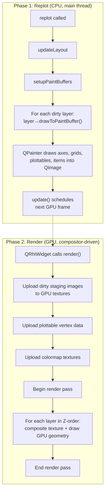
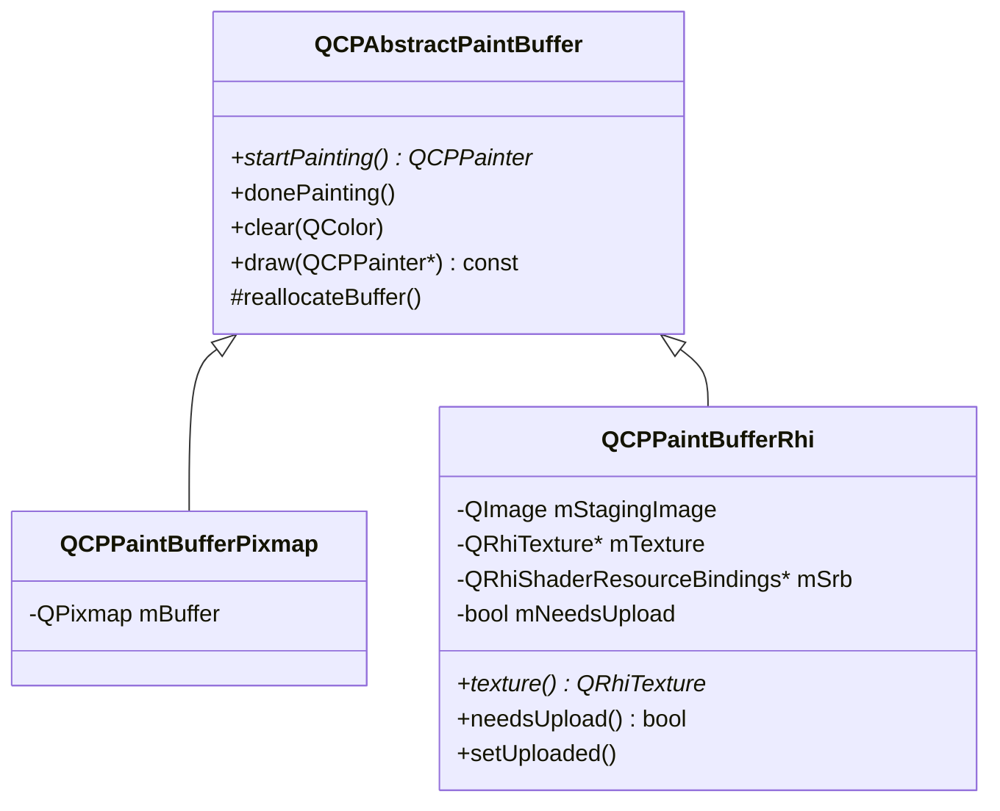
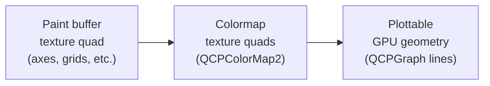
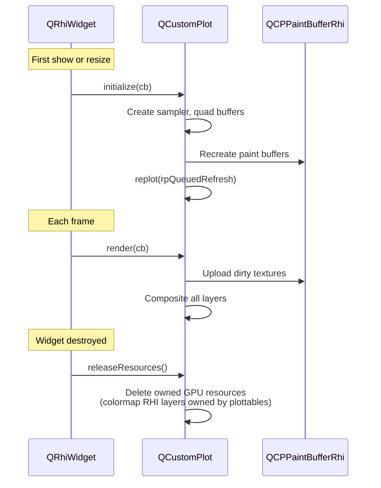

# QRhi Rendering Pipeline

NeoQCP renders plots using Qt's Rendering Hardware Interface (QRhi), which maps to the native graphics API on each platform: Vulkan on Linux, Metal on macOS, Direct3D on Windows.

## High-Level Architecture

`QCustomPlot` inherits from `QRhiWidget` (Qt 6.7+). The rendering happens in two distinct phases:



## The Two Phases in Detail

### Phase 1: Replot

`replot()` runs on the **main thread**. It walks all layers and asks each to paint its layerables (axes, grids, graphs, items) into a CPU-side `QImage` staging buffer via `QPainter`.

```
replot()
  ├── updateLayout()                    // recalculate layout element positions
  ├── setupPaintBuffers()               // create/resize QCPPaintBufferRhi instances
  ├── for each dirty layer:
  │     layer->drawToPaintBuffer()      // QPainter into QImage staging buffer
  ├── mark all buffers as clean
  └── update()                          // tell QRhiWidget to schedule a frame
```

Each layer owns a `QCPPaintBufferRhi` which wraps:
- A `QImage` staging buffer (ARGB32 premultiplied — QPainter's native format; converted to RGBA8 at GPU upload time)
- A `QRhiTexture*` (GPU texture, lazily created)
- A dirty flag (`mNeedsUpload`) set when painting finishes

Multiple logical layers can share a single paint buffer. The layer system groups layerables (grids, axes, graphs, items) into rendering units with independent opacity and draw order.

### Phase 2: Render

`render(QRhiCommandBuffer* cb)` is called by the Qt compositor. It never runs application code or QPainter — it only issues GPU commands.

```
render(cb)
  ├── Upload dirty staging images → GPU textures
  ├── Upload plottable RHI layer vertex buffers
  ├── Upload colormap RHI layer textures
  ├── Create composite pipeline (lazy, first frame only)
  ├── beginPass(clearColor)
  ├── for each layer in Z-order:
  │     ├── Composite paint buffer texture (fullscreen quad)
  │     ├── Draw colormap quads (scissored)
  │     └── Draw plottable geometry (scissored)
  └── endPass()
```

## Paint Buffer Hierarchy



- **QCPPaintBufferRhi** is used for on-screen rendering. Layers paint into the `QImage` via QPainter; the image is uploaded to a GPU texture when dirty.
- **QCPPaintBufferPixmap** is used for export paths (PDF, SVG, PNG) which bypass the RHI pipeline entirely.

## Compositing

Each paint buffer texture is drawn as a **fullscreen quad** with premultiplied alpha blending:

```
srcColor = One
dstColor = OneMinusSrcAlpha
```

The shaders are trivial:

**Vertex shader** (`composite.vert`): passes through position and texture coordinates. UV orientation is baked into the shared fullscreen quad vertices during `initialize()`, adjusted based on `isYUpInNDC()` (OpenGL has Y-up NDC; Metal/D3D have Y-down).

**Fragment shader** (`composite.frag`): samples the texture and outputs the color directly (premultiplied alpha is already baked into the staging image).

## Layer Compositing Order

The render loop iterates `mLayers` (not `mPaintBuffers`) because multiple layers can share one buffer. For each layer, three things are drawn in order:



A `QSet<QCPAbstractPaintBuffer*>` tracks already-composited buffers to avoid double-drawing when multiple layers share one buffer.

## Three Rendering Paths

NeoQCP has three distinct rendering paths depending on what is being drawn:

| Path | Used For | How It Works |
|---|---|---|
| **QPainter → texture composite** | Axes, grids, tick labels, items, legend, scatter markers, dashed lines | QPainter draws into QImage staging buffer; uploaded as GPU texture |
| **GPU plottable geometry** | QCPGraph/QCPCurve solid lines and baseline fills | CPU extrudes polylines into triangle strips (`QCPLineExtruder`); uploaded as vertex buffer; rendered with scissor clipping |
| **GPU colormap texture** | QCPColorMap2 heatmaps | CPU colorizes resampled data into QImage; uploaded as texture; rendered as scissored quad |

## GPU Resource Lifecycle



Key lifecycle rules:
- `initialize()` is called on first show **and on every resize** (the backing texture is recreated)
- On resize, the composite pipeline, layout SRB, all paint buffer SRBs, and all plottable/colormap RHI layer pipelines are invalidated — sampler and quad buffers survive
- Paint buffer SRBs are invalidated on resize because they reference the old render pass descriptor
- `releaseResources()` must clear paint buffers **before** the QRhi instance is destroyed

## Export Path (PDF/SVG/PNG)

Export completely bypasses the RHI pipeline:

```
savePdf() / saveSvg() / toPixmap()
  └── toPainter()
        └── for each layerable:
              layerable->draw(painter)    // QPainter on QPdfWriter/QSvgGenerator/QPixmap
```

This produces fully vectorial output for PDF/SVG. No paint buffers or GPU textures are involved.

## Key Files

| File | Role |
|---|---|
| `src/core.h/.cpp` | QCustomPlot class: `initialize()`, `render()`, `releaseResources()`, `replot()` |
| `src/painting/paintbuffer-rhi.h/.cpp` | QCPPaintBufferRhi: staging image + GPU texture + dirty tracking |
| `src/painting/paintbuffer.h/.cpp` | QCPAbstractPaintBuffer base class |
| `src/layer.h/.cpp` | QCPLayer: groups layerables, owns paint buffer reference |
| `src/painting/shaders/composite.vert` | Fullscreen quad vertex shader |
| `src/painting/shaders/composite.frag` | Texture sampling fragment shader |
| `src/painting/shaders/embed_shaders.py` | Build-time shader embedding (`.qsb` → C array header) |
| `src/painting/plottable-rhi-layer.h/.cpp` | Per-layer GPU resources for line plottable rendering |
| `src/painting/colormap-rhi-layer.h/.cpp` | Per-colormap GPU resources for heatmap rendering |
